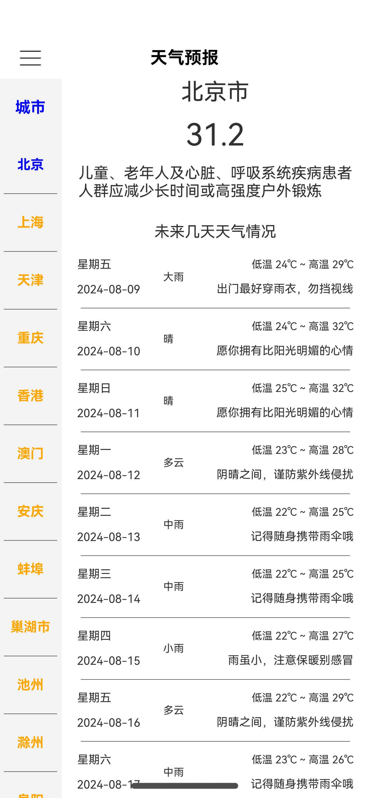

## 前言

鸿蒙作为新的平台，项目从 0 到 1，为了让软件快速上线，又能让开发和维护容易和高效，那么直接选择 MVI 软件架构模式进行开发。

## MVI

在介绍鸿蒙开发中的 MVI 之前，先回顾一下 MVI。

### MVI 基础概念

M-V-I 分别指的是：

*   Model：负责应用数据管理和业务逻辑处理，根据业务规则对数据进行创建，存储和更改。
*   View：负责界面展示，展示数据来源于 Model，以及响应数据变化；并接收用户操作，构建 Intent。
*   Intent：负责将用户操作或事件转换为状态变化。


### MVI 工作流程

1.  用户交互：用户在界面上进行操作，比如点击按钮、输入文字等。View 将这些操作转化为一个或多个 Intent 对象，Intent 对象主要描述用户想要执行的动作。
2.  意图传递：View 将构建的 Intent 对象传递给 ViewModel，ViewModel 为 View 和 Model 之间的桥梁，负责处理 Intent。
3.  数据更新：ViewModel 接收并处理 Intent 后，请求 Model 数据源更新数据。
4.  数据响应：Model 输出数据结果，更新数据状态。
5.  数据变化：View 订阅了数据的状态，当状态发生改变，View 自动刷新。
6.  展示状态：呈现最新状态。


工作流程反映了 MVI 架构模式关键特点：

1.  **分离关注点**：View, ViewModel, Model 职责明确，View 负责响应用户操作和响应状态变化，ViewModel 负责桥接 View 和 Model，并处理业务逻辑，Model 负责管理数据。这样组织和管理，有效降低了软件的复杂度。
2.  **数据驱动**：View 并不会去修改数据，当 Model 更新完数据时，View 通过感知到订阅的数据发生状态改变，自动更新。
3.  **单一数据源**：View 展示的数据，来源于订阅的某个不可变 State，State 的数据值表示某一刻的状态，每次要更新都是产生新的数据值。
4.  **单向数据流**：数据从 View → ViewModel → Model → ViewModel → View，View 传递 Intent 到 ViewModel，ViewModel 请求 Model 更新数据，Model 更新完数据，更新 View 订阅的 State 的数据值，View 自动更新。

### Android开发 MVI 核心组件

要使 MVI 架构模式在 Android 开发中运行起来，需要用到一些核心“组件”：

*   LifeCycle：感知 Activity 或 Fragment 的生命周期变化，方便业务针对生命周期变化做出相应管理和改变，也防止内存泄漏。
*   ViewModel：也可感知生命周期变化，在适当时候初始化和清理资源，如在 ViewModel 中启动和取消协程任务。
*   Kotlin Flow（冷流）：响应式编程（协程+冷流一起工作），做异步事件处理，如在 Repository 中 请求网络数据，存储数据到文件等。
*   Kotlin Flow（热流）：响应式编程（协程+热流一起工作），状态管理，如在 ViewModel 中管理 ViewState，View 订阅的 ViewState 改变后自动更新。
*   Kotlin Coroutine（协程）：响应式编程（协程+冷热流一起工作），管理任务，如在 Activity 或 ViewModel 中启动和取消任务。
*   Compose：声明式构建 UI。
*   依赖注入（Hilt）：管理对象的创建和依赖关系。

## 鸿蒙开发

### 鸿蒙开发 MVI 核心组件 

首先，鸿蒙开发中有一些前置条件：

1.  使用 ArkTS 语言（强制使用静态类型），基于 TypeScript 生态基础扩展，兼容 TS 和 JS。
2.  声明式构建 UI
3.  状态驱动 UI，状态数据改变，触发 UI 重新渲染。

要使 MVI 运行起来，需要核心组件：

1.  rxjs：三方库，响应式编程，处理异步操作，如：网络请求，数据存储等。
2.  promise：原生，处理异步操作。
3.  状态管理：通过 @State，@Observed，@ObjectLink，@Prop，@Link，@Provide/@Consume，@ObjectLink 状态装饰器管理变量状态。当View订阅的状态数据改变，自动更新。

另外，关于生命周期管理：状态管理可以感知组件生命周期，但使用 rxjs 启动的异步任务需要手动管理生命周期。另外，基于 Axios 的网络请求目前暂不支持取消。

目前基于 rxjs 和 @State，@Observed， @Watch 装饰器，就可以在普通业务场景使用 MVI。

### rxjs

rxjs 和 rxjava 同生于 [ReactiveX](https://github.com/ReactiveX)，在没有 Kotlin 协程和 Flow（冷流和热流）之前，在 Android 开发中都是使用 rxjava 来做响应式编程，对于 rxjs 在鸿蒙开发中的效果，它和 rxjava 在 Android 开发中的效果一样。

### 状态管理

鸿蒙目前状态管理有 V1稳定版本 和 V2试用版本，这里选择 V1。

> 当前状态管理（V2试用版）仍在逐步开发中，相关功能尚未成熟，建议开发者尝鲜试用。

状态管理作用：**实现数据和 UI 联动**。可以理解为类似 Android 中的 LiveData 和 StateFlow 或 SharedFlow，达到**数据驱动**和**单一数据源**的效果。

状态管理分为：应用状态管理和组件状态管理。

应用状态管理：使用 **@StorageLink/@LocalStorageLink** 状态装饰器实现应用和组件状态的双向同步，通过 **@StorageProp/@LocalStorageProp** 状态装饰器实现应用和组件状态的单向同步

**组件状态管理**：

<table>
    <tr>
        <td><b>@State</b></td>
        <td>@State 装饰的变量拥有其所属组件的状态，可以作为其子组件单向和双向同步的数据源。当其改变时，会引起相关组件的渲染刷新。</td>
    </tr>
    <tr>
        <td>@Prop</td>
        <td>@Prop 装饰的变量可以和父组件建立单向同步关系，@Prop 装饰的变量是可变的，但修改不会同步回父组件。</td>
    </tr>
    <tr>
        <td>@Link</td>
        <td>@Link 装饰的变量可以和父组件建立双向同步关系，子组件中 @Link 装饰的变量的修改回同步给父组件中建立双向数据绑定的数据源，父组件的更新也会同步给 @Link 装饰的变量。</td>
    </tr>
        <tr>
        <td>@Provide/@Consume</td>
        <td>@Provide/@Consume 装饰的变量用于跨组件层级（多层组件）同步状态变量，可以不需要通过参数命名机制传递，通过 alias(别名)或者属性绑定。</td>
    </tr>
    <tr>
        <td><b>@Observed</b></td>
        <td>@Observed 装饰 class，需要观察多层嵌套场景的 class 需要被 @Observed 装饰。单独使用 @Observed 没有任何作用，需要和 @ObjectLink、 @Prop 联用。</td>
    </tr>
        <tr>
        <td>@ObjectLink</td>
        <td>@ObjectLink 装饰的变量接收 @Observed 装饰的 class 的实例，应用于多层嵌套场景，和父组件的数据构建双向同步。</td>
    </tr>
</table>

**@Watch**：用于监听状态变量的变化，当状态变量变化时，@Watch 设置的监听回调函数将被调用。

#### 状态装饰器示例

这里只简单介绍 @State, @Observed, @Watch 相关使用。

##### @State

@State 装饰的变量是组件私有的，**只能在组件内操作**，变量的生命周期关联组件的生命周期。

```js
@Entry
@Componet
struct ExamplePage{

@State count: number = 1
//Text 可以感知到 count 的变化，自动更新
this.count = 1

Text(this.count)

@State objectA: ObjectA | undefine = undefine
//showView() 和 hideView() 可以感知到 objectA 的变化
this.objectA = new ObjectA() 

if(this.objectA){
  showView()
}else{
  hideView()
}

}
```

在实际的 MVI 中，View 只展示数据，不更改数据，所以 @State 的作用在 MVI 中主要用于感知状态数据改变。

##### @Observed

@Observed 装饰类，可以观察类属性的变化。如果类属性也是类对象，那么要观察该属性类对象的变化，该属性类也需要 @Observed 装饰。

    @Observed
    class ClassB{
      b: number = 0
    }

    @Observed
    class ClassA{
      a: number = 0
      
      b: ClassB = new ClassB()
    }

    a: ClassA = new ClassA()

    //可以观察到 对象 a 发生了变化
    this.a.a = 1
    //可以观察到 对象 a 发生了变化
    this.a.b = new ClassB()
    //对象 a 什么也没有发生
    this.a.b.b = 1


    b: ClassB = this.a.b
    //可以观察到 对象 b 发生了变化
    this.b.b = 1

##### @Watch

@Watch 装饰器用于对状态变量发生改变时，设置监听回调函数。类似 flow.collect{}, livedata.observe{}设置的监听回调函数。

```js
@State @Watch('onCountChanged') count = 0

onCountChanged(){
}

//会触发 onCountChanged 回调
this.count = 1
//不会触发 onCountChanged 回调
this.count = 0
```

有了响应式编程，又有了数据驱动，那么就可以开始使用 MVI 了。

### 鸿蒙 MVI 示例

这里以显示城市天气为例子 :



#### 环境

```shell
DevEco Studio NEXT Developer Beta2
Build #DS-233.14475.28.36.503502
Build Version: 5.0.3.502, built on July 28, 2024
Runtime version: 17.0.10+1-b1087.17 aarch64
VM: OpenJDK 64-Bit Server VM by JetBrains s.r.o.
macOS 14.3.1
GC: G1 Young Generation, G1 Old Generation
Memory: 2048M
Cores: 8
Registry:
  idea.plugins.compatible.build=IC-233.14475.28
```

#### 准备

安装网络库 [axios](https://gitee.com/openharmony-sig/ohos_axios)：

    ohpm install @ohos/axios

安装响应式编程库 [rxjs](https://gitee.com/openharmony-tpc/openharmony_tpc_samples/tree/master/RxJS)：

    ohpm install rxjs

项目添加依赖，目录：项目路径/entry/oh-package.json5：

```js
"dependencies": {
  "rxjs": "*"
}
```

rxjs 版本：rxjs@7.8.1

天气数据来源：

1.  城市码：[city code json](https://github.com/baichengzhou/weather.api/blob/master/src/main/resources/citycode-2019-08-23.json)，复制到：项目路径/entry/src/main/resources/rawfile/city\_code.json 文件中。
2.  天气城市 api: <http://t.weather.sojson.com/api/weather/city/城市码> （城市码在1 中的 json 文件中），api 返回的 json 数据例子：http://t.weather.sojson.com/api/weather/city/101010100 （北京市）。

时序图：


#### 开始

##### Model 层
1. 封装网络请求


```js
import axios, { AxiosInstance } from '@ohos/axios'

const BASE_URL = "http://t.weather.sojson.com/"
const TIMEOUT = 10 * 1000

export class AxiosHelper {
  private static INSTANCE: AxiosHelper = new AxiosHelper()
  private axiosInstance: AxiosInstance

  constructor() {
    this.axiosInstance = axios.create({ baseURL: BASE_URL, timeout: TIMEOUT })
  }

  static getAxiosInstance(): AxiosInstance {
    return AxiosHelper.INSTANCE.axiosInstance
  }
}
```

2. 数据模型

根据天气[城市码](https://github.com/baichengzhou/weather.api/blob/master/src/main/resources/citycode-2019-08-23.json)和[天气api](http://t.weather.sojson.com/api/weather/city/101010100)定义

```js
/**
 * 天气信息
 */
export interface Weather {
  //服务端返回的数据不允许再次修改
  readonly message: string
  readonly status: number
  readonly date: string
  readonly time: string
  readonly cityInfo: CityInfo
  readonly data: Data
}

export interface CityInfo {
  //省略
}

export interface Data {
 //省略
}

export interface Forecast {
  //省略
}

/**
 * 城市码信息
 */
export interface CityCodeInfo {
  city_code: string
  city_name: string
}

/**
 * 限制 Model 层返回的数据类型，类似 Kotlin 中的 Sealed Class
 */
export type WeatherData = Array<CityCodeInfo> | Weather
```
利用 `type`限制 Model 层返回数据类型，`type` 类似 kotlin `Sealed`修饰符。


3. Model 业务逻辑

```js

import { Observable } from 'rxjs'

export class WeatherRepository {
  /**
   * 缓存天气
   */
  private cachedWeather: Map<string, Weather> = new Map()

  private constructor() {
  }

  static newInstance(): WeatherRepository {
    return new WeatherRepository()
  }

  /**
   * 根据城市码请求城市天气
   * @param code 城市码
   * @returns 城市天气
   */
  fetchWeather(code: string): Observable<Weather> {
    return new Observable((subscribe) => {
      if (this.cachedWeather.has(code)) {
        subscribe.next(this.cachedWeather.get(code))
        subscribe.complete()
        return
      }
      AxiosHelper.getAxiosInstance().get(`api/weather/city/${code}`).then((resp: AxiosResponse<Weather>) => {
        if (resp.status === 200) {
          subscribe.next(resp.data)
          this.cachedWeather.set(code, resp.data)
          subscribe.complete()
        } else {
          subscribe.error(resp.statusText)
        }
      }).catch((e: Error) => {
        subscribe.error(e.message)
      })
    })
  }

  /**
   * 加载 raw 文件中城市码
   */
  loadCityCodeInfo(context: Context): Observable<Array<CityCodeInfo>> {
    return new Observable((subscribe) => {
      context.resourceManager.getRawFileContent('city_code.json').then((rawFile) => {
        const textDecoder = util.TextDecoder.create('utf-8', { ignoreBOM: true })
        const rawFileString = textDecoder.decodeWithStream(rawFile, { stream: false })
        const data: Array<CityCodeInfo> = JSON.parse(rawFileString)
        subscribe.next(data.filter((value) => value.city_code.length > 0))
        subscribe.complete()
      }).catch((e: Error) => {
        subscribe.error(e.message)
      })
    })
  }
}
```

##### ViewModel 层

1. 定义 Intent


```js
export class ViewIntent {
}

/**
 * 城市码 Intent
 */
export class CityCodeInfoIntent extends ViewIntent {
  readonly context: Context

  constructor(context: Context) {
    super()
    this.context = context;
  }
}

/**
 * 城市天气 Intent
 */
export class CityWeatherIntent extends ViewIntent {
  readonly cityCode: string

  constructor(cityCode: string) {
    super()
    this.cityCode = cityCode
  }
}

/*限制 Intent 类型*/
export type WeatherViewIntent = CityCodeInfoIntent | CityWeatherIntent
```

2. 定义 ViewState

```js
@Observed
export class ViewState<T> {
  readonly data: T | undefined

  constructor(data: T | undefined = undefined) {
    this.data = data
  }
}

@Observed
export class Init extends ViewState<WeatherData> {
}

@Observed
export class Loading extends ViewState<WeatherData> {
}

@Observed
export class Success extends ViewState<WeatherData> {
  constructor(data: WeatherData) {
    super(data)
  }
}

@Observed
export class Failure extends ViewState<WeatherData> {
  readonly code: number
  readonly message: string

  constructor(code: number, message: string) {
    super()
    this.code = code
    this.message = message
  }
}

/*限制 ViewState 类型*/
export type WeatherViewState = Success | Failure | Init | Loading
```
ViewState的定义遵循两个原则：
- 每次状态变化，都是产生新的值：new ViewState
- ViewState 需要 @Observed 装饰，表示可观察

3. 定义可观察的 State：`ObservedData<T>`

```js
export abstract class ObservedData<T> {
  /*View 只有读取 ViewModel 返回的状态权限*/
  private _value: T

  protected constructor(value: T) {
    this._value = value;
  }

  /*提供给 View 可读状态*/
  get value(): T {
    return this._value
  }

  /*只能 ViewModel 内部更改状态*/
  protected updateValue(value: T) {
    this._value = value
  }
}

/**
 * 可观察的天气状态
 */
@Observed
class WeatherObservedData extends ObservedData<WeatherViewState> {
  constructor(value: WeatherViewState) {
    super(value)
  }

  public updateValue(value: WeatherViewState): void {
    super.updateValue(value);
  }
}
```
鸿蒙中没有 LiveData 和 Flow，利用状态装饰器 @Obvsered 构建可观察状态。这里 ObservedData 的定义遵循两个原则：
- 状态只允许 ViewModel 写
- 状态只允许 View 读


4. ViewModel 业务逻辑
```js
export class WeatherViewModel {
  private readonly weatherRepository = WeatherRepository.newInstance()
  
  /*城市码状态，ViewModel 写状态*/
  private readonly _cityCodeInfoViewState: WeatherObservedData = new WeatherObservedData(new Init())
  /*城市码状态，View 读状态*/
  readonly cityCodeInfoViewState: ObservedData<WeatherViewState> = this._cityCodeInfoViewState

  /*城市天气状态，ViewModel 写状态*/
  private readonly _cityWeatherViewState: WeatherObservedData = new WeatherObservedData(new Init())
  /*城市天气状态，View 读状态*/
  readonly cityWeatherViewState: ObservedData<WeatherViewState> = this._cityWeatherViewState

  sendUIIntent(intent: WeatherViewIntent) {
    if (intent instanceof CityCodeInfoIntent) {
      this.handleCityCodeInfoIntent(intent)
    } else if (intent instanceof CityWeatherIntent) {
      this.handleCityWeatherIntent(intent)
    }
  }

  private handleCityCodeInfoIntent(intent: CityCodeInfoIntent) {
    this._cityCodeInfoViewState.updateValue(new Loading())
    this.weatherRepository.loadCityCodeInfo(intent.context).subscribe({
      next: (value) => {
        this._cityCodeInfoViewState.updateValue(new Success(value))
      }, error: (msg: string) => {
        this._cityCodeInfoViewState.updateValue(new Failure(0, msg))
      }
    })
  }

  private handleCityWeatherIntent(intent: CityWeatherIntent) {
    //这里需要注意，如果没有这一行代码，上一次返回 Success，下一次也返回 Success 时，View 会认为 cityWeatherViewState 并未改变
    this._cityWeatherViewState.updateValue(new Loading())
    this.weatherRepository.fetchWeather(intent.cityCode).subscribe({
      next: (value) => {
        this._cityWeatherViewState.updateValue(new Success(value))
      }, error: (msg: string) => {
        this._cityWeatherViewState.updateValue(new Failure(0, msg))
      }
    })
  }
}
```
 Model 返回数据后，ViewModel 通过 _cityCodeInfoViewState 或 _cityWeatherViewState 更改状态，View 感知 cityCodeInfoViewState 或 cityWeatherViewState 状态改变，自动更新 UI。类似 Android 中的：
 
```kotlin
private val _cityCodeInfoViewState: MutableStateFlow<ViewState<List<CityCodeInfo>>> =
    MutableStateFlow(ViewState.Init())
    
val cityCodeInfoViewState: StateFlow<ViewState<List<CityCodeInfo>>> = _cityCodeInfoViewState
```

另外，这里需要注意，如果没有下面这一行代码，上一次返回 Success，下一次也返回 Success 时，View 会认为 cityWeatherViewState 并未改变：

```js
this._cityWeatherViewState.updateValue(new Loading())
```
当然这与 View 中观察的状态有关。

因为 WeatherViewModel 无法感知生命周期，所以必要时需手动管理生命周期：

```js
private cityCodeInfoSubscription: Subscription | undefined = undefined

private handleCityCodeInfoIntent(intent: CityCodeInfoIntent) {
  this.cityCodeInfoSubscription = this.weatherRepository.loadCityCodeInfo(intent.context).subscribe()
}

onCleared(){
  this.cityCodeInfoSubscription?.unsubscribe()
}
```
 
 
##### View 层
```js
@Entry({ routeName: ROUTE_NAME_MVI })
@Component
struct Index {
  private weatherViewModel: WeatherViewModel = new WeatherViewModel()
  //观察城市码状态
  @State @Watch("onCityCodeInfo") cityCodeInfoViewState: ObservedData<WeatherViewState> =
    this.weatherViewModel.cityCodeInfoViewState
   //观察城市天气状态 
  @State cityWeatherViewState: ObservedData<WeatherViewState> =
    this.weatherViewModel.cityWeatherViewState

  aboutToAppear(): void {
    this.weatherViewModel.sendUIIntent(new CityCodeInfoIntent(getContext()))
  }
  
  aboutToDisappear(): void {
    //手动管理 ViewModel 生命周期
    this.weatherViewModel.onCleared()
  }

  /*城市码状态改变监听回调函数*/
  onCityCodeInfo() {
    //当城市码返回成功后，自动加载第一个城市天气
    const value = this.cityCodeInfoViewState.value
    if (value instanceof Success) {
      const data = (value as Success).data as Array<CityCodeInfo>
      if (data.length > 0) {
        this.weatherViewModel.sendUIIntent(new CityWeatherIntent(data[0].city_code))
      }
    }
  }

  build() {
    Column() {
      this.titleBar()
      this.contentView()
    }
  }

  @Builder
  titleBar() {
    //省略
  }

  @Builder
  contentView() {
    if (this.cityCodeInfoViewState.value instanceof Success) {
      SideBarContainer(SideBarContainerType.Embed) {
        this.cityCodeInfoView((this.cityCodeInfoViewState.value as Success).data as Array<CityCodeInfo>)
        if (this.cityWeatherViewState.value instanceof Success) {
          this.weatherDetailView((this.cityWeatherViewState.value as Success).data as Weather)
        } else if (this.cityWeatherViewState.value instanceof Failure) {
          this.errorView((this.cityWeatherViewState.value as Failure).message)
        } else {
          this.loadingView()
        }
      }
      //省略
    } else if (this.cityCodeInfoViewState.value instanceof Failure) {
      this.errorView((this.cityCodeInfoViewState.value as Failure).message)
    } else {
      this.loadingView()
    }
  }

  @Builder
  errorView(error: string) {
    //省略
  }

  @Builder
  loadingView() {
    //省略
  }

  @Builder
  cityCodeInfoView(info: Array<CityCodeInfo>) {
    Column() {
      //省略
      List() {
        ForEach(info,
          (item: CityCodeInfo, index: number) => {
            ListItem() {
              Text(item.city_name)
                   //省略
                })
            }
          }, (item: CityCodeInfo) => item.city_code)
      }
    }
  }

  @Builder
  weatherDetailView(weather: Weather) {
   //省略
  }
}
```
当观察的 cityCodeInfoViewState 发生改变时，下面逻辑会自动执行，触发UI重新渲染。

```js
if (this.cityCodeInfoViewState.value instanceof Success) {

} else if (this.cityCodeInfoViewState.value instanceof Failure) {
  this.errorView((this.cityCodeInfoViewState.value as Failure).message)
} else {
  this.loadingView()
}
```
同时`onCityCodeInfo()`也会被调用。同理 `this.cityWeatherViewState`也一样。

如果页面是父子组件结构，需要将 ViewModel 在父子组件中共享，可以使用 `@Provide/@Consume` 装饰：

```js
//父组件
@Provide weatherViewModel: WeatherViewModel = new WeatherViewModel()

//子组件
@Consume weatherViewModel: WeatherViewModel
@State @Watch("onCityCodeInfo") cityCodeInfoViewState: ObservedData<WeatherViewState> =
  this.weatherViewModel.cityCodeInfoViewState
@State cityWeatherViewState: ObservedData<WeatherViewState> =
  this.weatherViewModel.cityWeatherViewState

onCityCodeInfo() {
 
}
```
在子组件中，也能感知到 cityCodeInfoViewState 和 cityWeatherViewState 状态的改变。

##### 示例效果


## 总结
软件架构设计是为了制定规范和约束，达到程序的组织和管理，从而使软件开发和维护变得容易和高效。

MVI 架构模式作为 Android 推崇架构模式，它带来的主要好处是：
- 方便开发和维护，开发：简单易于理解的设计（最小复杂度），维护：能轻易入手该设计。
- 新手和老手都能快速上手，在项目中，所有人达成共识，形成一致性，从而短时间内提高开发效率。
- 程序从开始到结束，整个生命周期范围内，都在明确定义的流程里执行，这可以方便排查问题，以及保障质量和稳定。

在鸿蒙开发中，通过响应式编 rxjs 和 状态管理@State, @Observed, @Watch 装饰器即可实现简单的 MVI 架构模式。

在鸿蒙开发中，使用 MVI，能够顺利进行大量的常规需求快速开发，能够让其他开发人员快速参与进来，并能够保障项目的线上质量和稳定。